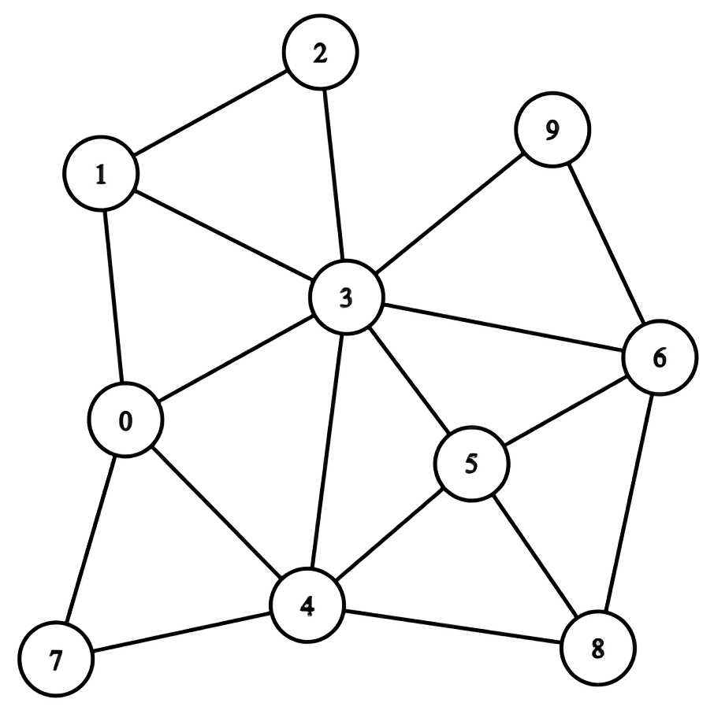
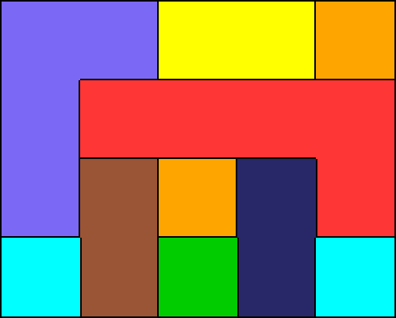

# Collaborative-Graph-Coloring-Game
---

This project aims to study and rank joint policies in dynamic games using evolutionary dynamics. It applies the $\alpha$-Rank evolutionary methodology to evaluate joint policies in a stochastic version of the graph coloring game. This repository contains the code accompanying the paper **_Ranking Joint Policies in Dynamic Games using Evolutionary Dynamics_**, which was submitted to and accepted at the 24th International Conference
on Autonomous Agents and Multiagent Systems (AAMAS 2025).

<p align="center">
  
  
</p>

## Prerequisites
This project uses **Poetry** for dependency management.

To set up the environment:
1. Install Poetry (if not already installed):
   ```bash
   pip install poetry
   ```
2. Clone the repository and navigate into it:
   ```bash
    git clone https://github.com/your_username/cgcg.git
    cd cgcg
    ```
3. Install dependencies:
   ```bash
    poetry install
    ```

## How to Run the Code
The repository provides multiple entry points for running the code:

## Acknowledgments
I would like to express my sincere gratitude to the creators of $\alpha$-Rank for their foundational work in the paper ["α-Rank: Multi-Agent Evaluation by Evolutionary Dynamics"](https://www.nature.com/articles/s41598-019-45619-9). Their novel evolutionary methodology provided the theoretical framework for my own research on ranking joint policies in dynamic games. I would also like to thank DeepMind for including $\alpha$-Rank in their [OpenSpiel](https://github.com/google-deepmind/open_spiel) library. Their implementation was straightforward and easy to apply to my own custom game.

## Author
Natalia Koliou: find me on [LinkedIn](https://www.linkedin.com/in/natalia-koliou-b37b01197/).